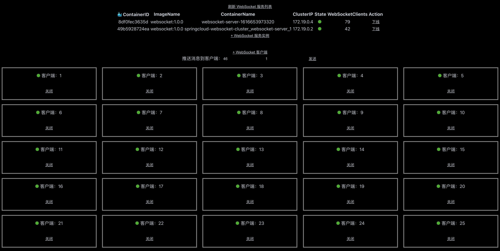

# Demo front-end project for WebSocket cluster 

此项目为[实战 Spring Cloud 的 WebSocket 集群](https://github.com/Lonor/websocket-cluster)的前端页面。

## 本地运行

新建 `.env.development.local` 文件，添加相关环境变量：

```
REACT_APP_BASE_DOMAIN=localhost:7000
```

启动项目
```
yarn
yarn start
```

访问 `http://localhost:3000` 即可查看效果。

## 效果图


